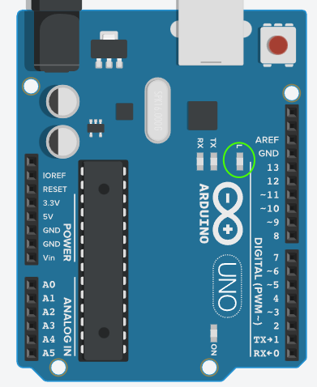

## Day 3: Blink
Today we learn the embedded systems version of "Hello, world," which is to blink an LED. This is
used in place of the more traditional "Hello, world," we learned in the last lesson since many embedded
systems lack any sort of display for text. Fortunately for us, all Arduino boards have an on-board LED
that a programmer can control.

You can see its location here, circled in green:

### Today's Goals
- Learn the basic anatomy of an Arduino development board
- Learn about the function of digital pins
- Learn to configure a digital pin
- Learn the "Blink" program

### From the Docs
- [Arduino Sketches](https://docs.arduino.cc/learn/programming/sketches/): Reviews much of what has been covered so far, and offers a peek ahead at variables, which will be covered in the next lesson.
- [Anatomy of an Arduino Board](https://docs.arduino.cc/learn/starting-guide/getting-started-arduino/#anatomy-of-an-arduino-board): Also gives an overview of upcoming topics.
- [Digital Pins](https://docs.arduino.cc/learn/microcontrollers/digital-pins/): Some technical information on how Arduino's digital pins operate. For now we're mostly focused on the `OUTPUT` configuration.
- [pinMode()](https://docs.arduino.cc/language-reference/en/functions/digital-io/pinMode/): Documentation on the `pinMode()` function.
- [digitalWrite()](https://docs.arduino.cc/language-reference/en/functions/digital-io/digitalwrite/): Documentation on the `digitalWrite()` function.
- [delay()](https://docs.arduino.cc/language-reference/en/functions/time/delay/): Documentation on the `delay()` function.

### Activities
- Tinkercad: ***Code Walk: Blink***
- Tinkercad: ***Debug: Blink***
- Tinkercad: ***From Scratch: Blink***
